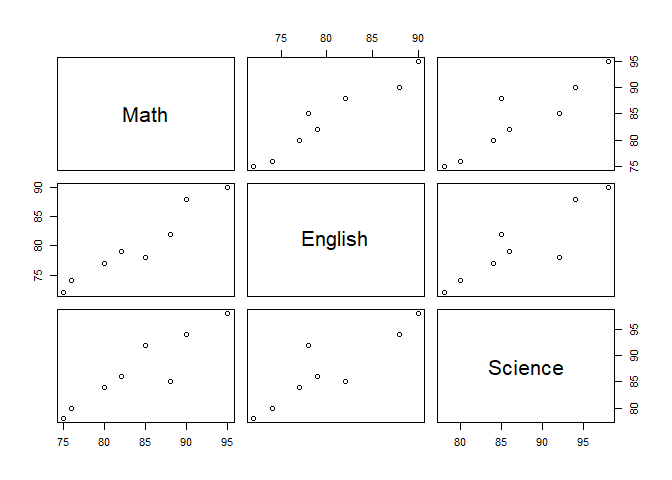
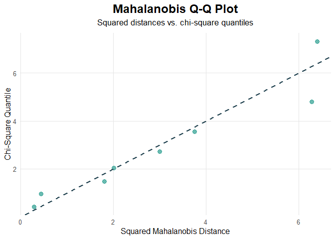
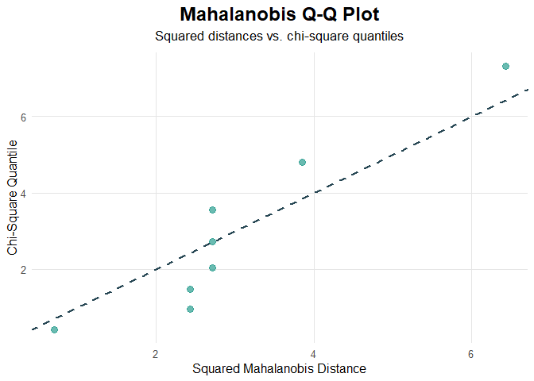

OL ACT 1
================
Baybayon, Darlyn Antoinette B.

# Hands-on Activity: Exploring Multivariate Data

``` r
suppressPackageStartupMessages({
  library(ggplot2)
  library(tidyverse)
  library(dplyr)
  library(readr)
  library(forecast)
  library(rmarkdown)
  library(MVN)
})
```

### I. Student Performance

1.  Import and Inspect Data

``` r
Student <- c("S1", "S2", "S3", "S4", "S5", "S6", "S7", "S8")
Math <- c(85, 88, 76, 90, 82,75,95, 80)
English <- c(78, 82, 74, 88, 79, 72, 90, 77)
Science <- c(92, 85, 80, 94, 86, 78, 98, 84)

students <- data.frame(Student, Math, English, Science)

students
```

    ##   Student Math English Science
    ## 1      S1   85      78      92
    ## 2      S2   88      82      85
    ## 3      S3   76      74      80
    ## 4      S4   90      88      94
    ## 5      S5   82      79      86
    ## 6      S6   75      72      78
    ## 7      S7   95      90      98
    ## 8      S8   80      77      84

The dataset has 8 observations and 4 columns - Student, Math, English,
and Science.

The basic summary statistics for each column is displayed below.

``` r
summary(students)
```

    ##    Student               Math          English         Science     
    ##  Length:8           Min.   :75.00   Min.   :72.00   Min.   :78.00  
    ##  Class :character   1st Qu.:79.00   1st Qu.:76.25   1st Qu.:83.00  
    ##  Mode  :character   Median :83.50   Median :78.50   Median :85.50  
    ##                     Mean   :83.88   Mean   :80.00   Mean   :87.12  
    ##                     3rd Qu.:88.50   3rd Qu.:83.50   3rd Qu.:92.50  
    ##                     Max.   :95.00   Max.   :90.00   Max.   :98.00

2.  Compute Mean Vectors

``` r
grades <- students[,2:4]
mean_grades <- colMeans(grades)

mean_grades
```

    ##    Math English Science 
    ##  83.875  80.000  87.125

3.  Compute Covariance & Correlation Matrices

``` r
cov_grades <-cov(grades)
cov_grades
```

    ##             Math  English  Science
    ## Math    48.41071 42.57143 44.44643
    ## English 42.57143 40.28571 39.42857
    ## Science 44.44643 39.42857 48.41071

``` r
cor(grades)
```

    ##              Math   English   Science
    ## Math    1.0000000 0.9639887 0.9181114
    ## English 0.9639887 1.0000000 0.8928218
    ## Science 0.9181114 0.8928218 1.0000000

4.  Scatterplots & Pair Plots

``` r
pairs(grades)
```

<!-- -->

5.  Distance Measures

Compute Euclidean and Mahalanobis distances.

``` r
euclidean_dist <- dist(grades, method="euclidean")
as.matrix(round(euclidean_dist,4))
```

    ##         1       2       3       4       5       6       7       8
    ## 1  0.0000  8.6023 15.5242 11.3578  6.7823 18.2209 16.7332  9.4868
    ## 2  8.6023  0.0000 15.2643 11.0000  6.7823 17.8326 16.7929  9.4868
    ## 3 15.5242 15.2643  0.0000 24.2487  9.8489  3.0000 30.6757  6.4031
    ## 4 11.3578 11.0000 24.2487  0.0000 14.4568 27.1477  6.7082 17.9165
    ## 5  6.7823  6.7823  9.8489 14.4568  0.0000 12.7279 20.8327  3.4641
    ## 6 18.2209 17.8326  3.0000 27.1477 12.7279  0.0000 33.5261  9.2736
    ## 7 16.7332 16.7929 30.6757  6.7082 20.8327 33.5261  0.0000 24.2899
    ## 8  9.4868  9.4868  6.4031 17.9165  3.4641  9.2736 24.2899  0.0000

``` r
d <- matrix(0, 8,8)
for (i in 1:8){
  for (j in 1:8){
    d[i,j] <- mahalanobis(as.numeric(grades[i, ]), as.numeric(grades[j, ]), cov = cov_grades)
  }
}

round(d,4)
```

    ##         [,1]    [,2]   [,3]    [,4]   [,5]   [,6]   [,7]   [,8]
    ## [1,]  0.0000 13.8449 9.3931 12.9451 6.6260 8.3196 7.3563 6.4945
    ## [2,] 13.8449  0.0000 9.5723 12.2484 7.7017 7.2103 7.5396 7.6954
    ## [3,]  9.3931  9.5723 0.0000  5.1671 0.8068 0.5800 7.6874 0.4446
    ## [4,] 12.9451 12.2484 5.1671  0.0000 2.7003 7.8899 2.5448 3.8144
    ## [5,]  6.6260  7.7017 0.8068  2.7003 0.0000 1.5487 3.5582 0.1055
    ## [6,]  8.3196  7.2103 0.5800  7.8899 1.5487 0.0000 8.6558 0.8804
    ## [7,]  7.3563  7.5396 7.6874  2.5448 3.5582 8.6558 0.0000 4.6688
    ## [8,]  6.4945  7.6954 0.4446  3.8144 0.1055 0.8804 4.6688 0.0000

6.  Test Multivariate Normality

``` r
mardia(grades)
```

    ##              Test  Statistic    p.value     Method
    ## 1 Mardia Skewness 17.5798464 0.06247834 asymptotic
    ## 2 Mardia Kurtosis -0.2843396 0.77615015 asymptotic

The skewness statistic was 17.58 (p = 0.062), and the kurtosis statistic
was -0.28 (p = 0.776). SInce both p-values exceed the significance level
of 0.05, we have insufficient evidence to reject multivariate normality.
Thus, this we can reasonably assume that this dataset follows a
multivariate normal distribution.

7.  Visualize Multivariate Normality

``` r
multivariate_diagnostic_plot(grades, type="qq")
```

<!-- -->

The plot above shows the multivariate Q-Q plot of the squared
Mahalanobis distances to assess multivariate normality. As showm, the
points in the plot lie closely along the diagonal, indicating good
agreement with the expected normal distribution.

8.  Linear Combination of 2 Variables

``` r
grades$MathSci <- 0.5*grades$Math + 0.5*grades$Science

grades$MathSci
```

    ## [1] 88.5 86.5 78.0 92.0 84.0 76.5 96.5 82.0

``` r
mean(grades$MathSci)
```

    ## [1] 85.5

``` r
var(grades$MathSci)
```

    ## [1] 46.42857

``` r
cor(grades$MathSci, grades$English)
```

    ## [1] 0.948016

### II. Plant Measurements

1.  Import & Inspect Data

``` r
Plant <-  c("P1", "P2", "P3", "P4", "P5", "P6", "P7", "P8")
Height <- c(25, 28, 22, 30, 24, 27, 29, 23)
LeafLength <- c(10,12,9, 14, 11, 13, 15, 10)
LeafWidth <- c(4, 5, 3, 6, 4, 5, 6, 3)

plant <- data.frame(Plant, Height, LeafLength, LeafWidth)
plant
```

    ##   Plant Height LeafLength LeafWidth
    ## 1    P1     25         10         4
    ## 2    P2     28         12         5
    ## 3    P3     22          9         3
    ## 4    P4     30         14         6
    ## 5    P5     24         11         4
    ## 6    P6     27         13         5
    ## 7    P7     29         15         6
    ## 8    P8     23         10         3

The dataset has 8 observations and 4 columns - Plant, Height,
LeafLength, and LeafWidth.

The basic summary statistics for each column is displayed below.

``` r
summary(plant)
```

    ##     Plant               Height        LeafLength      LeafWidth   
    ##  Length:8           Min.   :22.00   Min.   : 9.00   Min.   :3.00  
    ##  Class :character   1st Qu.:23.75   1st Qu.:10.00   1st Qu.:3.75  
    ##  Mode  :character   Median :26.00   Median :11.50   Median :4.50  
    ##                     Mean   :26.00   Mean   :11.75   Mean   :4.50  
    ##                     3rd Qu.:28.25   3rd Qu.:13.25   3rd Qu.:5.25  
    ##                     Max.   :30.00   Max.   :15.00   Max.   :6.00

2.  Compute Mean Vectors

``` r
dims <- plant[,2:4]
mean_plant <- colMeans(dims)
mean_plant
```

    ##     Height LeafLength  LeafWidth 
    ##      26.00      11.75       4.50

3.  Compute Covariance & Correlation Matrices

``` r
cov_dims <- cov(dims)
cov_dims
```

    ##              Height LeafLength LeafWidth
    ## Height     8.571429   5.714286  3.428571
    ## LeafLength 5.714286   4.500000  2.428571
    ## LeafWidth  3.428571   2.428571  1.428571

``` r
cor(dims)
```

    ##               Height LeafLength LeafWidth
    ## Height     1.0000000  0.9200874 0.9797959
    ## LeafLength 0.9200874  1.0000000 0.9578415
    ## LeafWidth  0.9797959  0.9578415 1.0000000

4.  Scatterplots & Pair Plots

``` r
pairs(dims)
```

<!-- -->

5.  Distance Measures

Compute Euclidean and Mahalanobis distances.

``` r
euclidean_dist <- dist(dims, method="euclidean")
as.matrix(round(euclidean_dist,4))
```

    ##        1      2      3      4      5      6      7      8
    ## 1 0.0000 3.7417 3.3166 6.7082 1.4142 3.7417 6.7082 2.2361
    ## 2 3.7417 0.0000 7.0000 3.0000 4.2426 1.4142 3.3166 5.7446
    ## 3 3.3166 7.0000 0.0000 9.8995 3.0000 6.7082 9.6954 1.4142
    ## 4 6.7082 3.0000 9.8995 0.0000 7.0000 3.3166 1.4142 8.6023
    ## 5 1.4142 4.2426 3.0000 7.0000 0.0000 3.7417 6.7082 1.7321
    ## 6 3.7417 1.4142 6.7082 3.3166 3.7417 0.0000 3.0000 5.3852
    ## 7 6.7082 3.3166 9.6954 1.4142 6.7082 3.0000 0.0000 8.3666
    ## 8 2.2361 5.7446 1.4142 8.6023 1.7321 5.3852 8.3666 0.0000

``` r
d <- matrix(0, 8,8)
for (i in 1:8){
  for (j in 1:8){
    d[i,j] <- mahalanobis(as.numeric(dims[i, ]), as.numeric(dims[j, ]), cov = cov_dims)
  }
}

round(d,4)
```

    ##       [,1] [,2] [,3]  [,4]  [,5] [,6]  [,7]  [,8]
    ## [1,]  0.00 2.50 2.50  4.25  4.25 5.25 10.00 11.25
    ## [2,]  2.50 0.00 7.00  1.25  8.25 4.25  8.50  8.25
    ## [3,]  2.50 7.00 0.00  8.25  1.25 4.25  8.50  8.25
    ## [4,]  4.25 1.25 8.25  0.00  7.00 2.50  4.25 10.50
    ## [5,]  4.25 8.25 1.25  7.00  0.00 2.50  4.25 10.50
    ## [6,]  5.25 4.25 4.25  2.50  2.50 0.00  1.25  6.00
    ## [7,] 10.00 8.50 8.50  4.25  4.25 1.25  0.00 11.25
    ## [8,] 11.25 8.25 8.25 10.50 10.50 6.00 11.25  0.00

6.  Test Multivariate Normality

``` r
mardia(dims)
```

    ##              Test  Statistic   p.value     Method
    ## 1 Mardia Skewness 11.0545190 0.3532863 asymptotic
    ## 2 Mardia Kurtosis -0.9484857 0.3428822 asymptotic

7.  Visualize Multivariate Normality

``` r
multivariate_diagnostic_plot(dims, type="qq")
```

<!-- -->

### III. Reflection

1.  Which variables have the largest and smallest ranges? What might
    this tell you about the variability of each variable?

2.  Are there any apparent outliers in the datasets? How would they
    affect your analysis?

3.  Compare the mean vectors of the Student and Plant datasets. What do
    the means tell you about the “center” of each dataset?

4.  How could these mean vectors be used in comparing observations or
    groups?

5.  Identify the strongest positive and negative correlations. What does
    this imply about the relationships between variables?

6.  How does standardizing variables affect the correlation matrix
    compared to the covariance matrix?

7.  Why is it important to examine both covariance and correlation when
    analyzing multivariate data?

8.  Are the relationships between variables approximately linear? Which
    variable pairs, if any, show nonlinear trends?

9.  Do the plots reveal potential clusters or subgroups within the data?
    How might this influence further analysis?

10. Compare Euclidean and Mahalanobis distances for the same
    observations. How does Mahalanobis distance account for variable
    correlations?

11. Which observations are farthest from the center of the dataset? Are
    these potential outliers?

12. Do the Mardia test results suggest that the datasets follow a
    multivariate normaldistribution?

13. If the assumption of multivariate normality is violated, what
    implications might this have for analyses such as MANOVA or
    discriminant analysis?

14. Examine the Q-Q plots of Mahalanobis distances. Do points deviate
    strongly from the line? Which observations might be problematic?

15. How do the visual plots complement or contrast with the numerical
    test results?

16. How does creating a linear combination of variables (e.g., Math +
    Science) affect the variance?

17. How is the correlation of this new variable with another variable
    (e.g., English) useful in understanding combined effects?

18. Could linear combinations be used to create indices or scores?
    Provide an example from a real-world context.

19. Across the analyses, which variable(s) appear most influential in
    defining the overall structure of the datasets?

20. If you were to perform a principal component analysis (PCA), how
    might the findings from your scatterplots, correlations, and linear
    combinations guide you?
