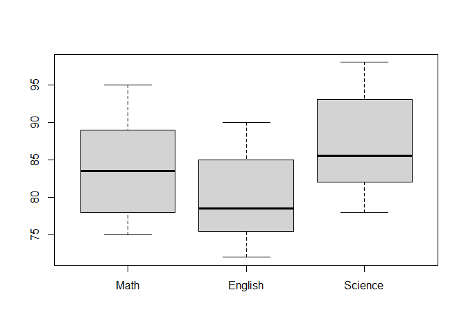

Formative Assessment 1
================
Baybayon, Darlyn Antoinette B.

# Exploring Multivariate Data

``` r
suppressPackageStartupMessages({
  library(ggplot2)
  library(tidyverse)
  library(dplyr)
  library(readr)
  library(forecast)
  library(MVN)
  
})
```

### I. Student Performance

1.  Import and Inspect Data

``` r
Student <- c("S1", "S2", "S3", "S4", "S5", "S6", "S7", "S8")
Math <- c(85, 88, 76, 90, 82,75,95, 80)
English <- c(78, 82, 74, 88, 79, 72, 90, 77)
Science <- c(92, 85, 80, 94, 86, 78, 98, 84)

students <- data.frame(Student, Math, English, Science)

students
```

    ##   Student Math English Science
    ## 1      S1   85      78      92
    ## 2      S2   88      82      85
    ## 3      S3   76      74      80
    ## 4      S4   90      88      94
    ## 5      S5   82      79      86
    ## 6      S6   75      72      78
    ## 7      S7   95      90      98
    ## 8      S8   80      77      84

The dataset has 8 observations and 4 columns - Student, Math, English,
and Science.

The basic summary statistics for each column is displayed below.

``` r
grades <- students[,2:4]
summary(grades)
```

    ##       Math          English         Science     
    ##  Min.   :75.00   Min.   :72.00   Min.   :78.00  
    ##  1st Qu.:79.00   1st Qu.:76.25   1st Qu.:83.00  
    ##  Median :83.50   Median :78.50   Median :85.50  
    ##  Mean   :83.88   Mean   :80.00   Mean   :87.12  
    ##  3rd Qu.:88.50   3rd Qu.:83.50   3rd Qu.:92.50  
    ##  Max.   :95.00   Max.   :90.00   Max.   :98.00

Distribution per subject:

``` r
boxplot(grades)
```

<!-- -->

``` r
apply(grades, 2, function(x) shapiro.test(x)$p.value)
```

    ##      Math   English   Science 
    ## 0.8712279 0.5774809 0.7584233

Since p \> 0.05 for all columns, the distribution of grades for each
subject is normal.

2.  Compute Mean Vectors

``` r
center_grades <- colMeans(grades)

center_grades
```

    ##    Math English Science 
    ##  83.875  80.000  87.125

3.  Compute Covariance & Correlation Matrices

``` r
cov_grades <-cov(grades)
cov_grades
```

    ##             Math  English  Science
    ## Math    48.41071 42.57143 44.44643
    ## English 42.57143 40.28571 39.42857
    ## Science 44.44643 39.42857 48.41071

``` r
cor(grades)
```

    ##              Math   English   Science
    ## Math    1.0000000 0.9639887 0.9181114
    ## English 0.9639887 1.0000000 0.8928218
    ## Science 0.9181114 0.8928218 1.0000000

4.  Scatterplots & Pair Plots

``` r
pairs(grades)
```

<!-- -->

5.  Distance Measures

Compute Euclidean and Mahalanobis distances.

``` r
euclidean_dist_student <- apply(grades, 1, function(x) {
  sqrt(sum((x - center_grades)^2))
})

names(euclidean_dist_student) <- students$Student
round(euclidean_dist_student, 4)
```

    ##      S1      S2      S3      S4      S5      S6      S7      S8 
    ##  5.3881  5.0528 12.1976 12.1976  2.4044 15.0343 18.4941  5.8122

``` r
mahalanobis_dist_student <- mahalanobis(grades, center_grades, cov_grades)
names(mahalanobis_dist_student) <- students$Student
round(mahalanobis_dist_student, 4)
```

    ##     S1     S2     S3     S4     S5     S6     S7     S8 
    ## 5.4974 5.6016 1.5814 3.2888 0.2559 1.7606 2.6264 0.3879

6.  Test Multivariate Normality

``` r
MVN::mardia(grades)
```

    ##              Test  Statistic    p.value     Method
    ## 1 Mardia Skewness 17.5798464 0.06247834 asymptotic
    ## 2 Mardia Kurtosis -0.2843396 0.77615015 asymptotic

The skewness statistic was 17.58 (p = 0.062), and the kurtosis statistic
was -0.28 (p = 0.776). SInce both p-values exceed the significance level
of 0.05, there are no significant skewness and excess kurtosis. Thus,
based on Mardia’s test, we have insufficient evidence to reject
multivariate normality assumption and can reasonably assume that this
dataset follows a multivariate normal distribution.

``` r
MVN::hz(grades)
```

    ##            Test Statistic    p.value     Method
    ## 1 Henze-Zirkler 0.7730618 0.02566557 asymptotic

The Henze-Zirkler test tests the deviation from multivariate normality.
The result show a statistic of 0.773 and p = 0.02 which indicates
significant evidence to reject multivariate normality.

7.  Visualize Multivariate Normality

``` r
multivariate_diagnostic_plot(grades, type="qq")
```

<!-- -->

The plot above shows the multivariate Q-Q plot of the squared
Mahalanobis distances to assess multivariate normality. As shown, most
of the points in the plot lie closely along the diagonal, indicating
good agreement with the expected normal distribution with some larger
deviations from the center.

8.  Linear Combination of 2 Variables

``` r
grades$MathSci <- 0.5*grades$Math + 0.5*grades$Science

grades$MathSci
```

    ## [1] 88.5 86.5 78.0 92.0 84.0 76.5 96.5 82.0

``` r
data.frame(
  Mean = mean(grades$MathSci),
  Var = var(grades$MathSci),
  Cor_with_Eng = cor(grades$MathSci, grades$English)
)
```

    ##   Mean      Var Cor_with_Eng
    ## 1 85.5 46.42857     0.948016

``` r
sapply(grades, var)
```

    ##     Math  English  Science  MathSci 
    ## 48.41071 40.28571 48.41071 46.42857

``` r
(0.5**2) * var(grades$Math) + (0.5**2)* var(grades$Science) + (2*0.5*0.5) * cov(grades$Math, grades$Science)
```

    ## [1] 46.42857

### II. Plant Measurements

1.  Import & Inspect Data

``` r
Plant <-  c("P1", "P2", "P3", "P4", "P5", "P6", "P7", "P8")
Height <- c(25, 28, 22, 30, 24, 27, 29, 23)
LeafLength <- c(10,12,9, 14, 11, 13, 15, 10)
LeafWidth <- c(4, 5, 3, 6, 4, 5, 6, 3)

plant <- data.frame(Plant, Height, LeafLength, LeafWidth)
plant
```

    ##   Plant Height LeafLength LeafWidth
    ## 1    P1     25         10         4
    ## 2    P2     28         12         5
    ## 3    P3     22          9         3
    ## 4    P4     30         14         6
    ## 5    P5     24         11         4
    ## 6    P6     27         13         5
    ## 7    P7     29         15         6
    ## 8    P8     23         10         3

The dataset has 8 observations and 4 columns - Plant, Height,
LeafLength, and LeafWidth.

The basic summary statistics for each column is displayed below.

``` r
dims <- plant[,2:4]
summary(dims)
```

    ##      Height        LeafLength      LeafWidth   
    ##  Min.   :22.00   Min.   : 9.00   Min.   :3.00  
    ##  1st Qu.:23.75   1st Qu.:10.00   1st Qu.:3.75  
    ##  Median :26.00   Median :11.50   Median :4.50  
    ##  Mean   :26.00   Mean   :11.75   Mean   :4.50  
    ##  3rd Qu.:28.25   3rd Qu.:13.25   3rd Qu.:5.25  
    ##  Max.   :30.00   Max.   :15.00   Max.   :6.00

Distribution of each variable

``` r
boxplot(dims)
```

<!-- -->

``` r
apply(dims, 2, function(x) shapiro.test(x)$p.value)
```

    ##     Height LeafLength  LeafWidth 
    ##  0.7159952  0.7357702  0.2738055

Since p \> 0.05 for every column, the distributions of each dimension of
plants are normal.

2.  Compute Mean Vectors

``` r
center_dims <- colMeans(dims)
center_dims
```

    ##     Height LeafLength  LeafWidth 
    ##      26.00      11.75       4.50

3.  Compute Covariance & Correlation Matrices

``` r
cov_dims <- cov(dims)
cov_dims
```

    ##              Height LeafLength LeafWidth
    ## Height     8.571429   5.714286  3.428571
    ## LeafLength 5.714286   4.500000  2.428571
    ## LeafWidth  3.428571   2.428571  1.428571

``` r
cor(dims)
```

    ##               Height LeafLength LeafWidth
    ## Height     1.0000000  0.9200874 0.9797959
    ## LeafLength 0.9200874  1.0000000 0.9578415
    ## LeafWidth  0.9797959  0.9578415 1.0000000

4.  Scatterplots & Pair Plots

``` r
pairs(dims)
```

<!-- -->

5.  Distance Measures

Compute Euclidean and Mahalanobis distances.

``` r
euclidean_dist_plant <- apply(dims, 1, function(x) {
  sqrt(sum((x - center_dims)^2))
})

names(euclidean_dist_plant) <- plant$Plant
round(euclidean_dist_plant, 4)
```

    ##     P1     P2     P3     P4     P5     P6     P7     P8 
    ## 2.0767 2.0767 5.0806 4.8283 2.1937 1.6771 4.6704 3.7832

``` r
mahalanobis_dist_plant <- mahalanobis(dims, center_dims, cov_dims)
names(mahalanobis_dist_plant) <- plant$Plant
round(mahalanobis_dist_plant, 4)
```

    ##    P1    P2    P3    P4    P5    P6    P7    P8 
    ## 2.375 2.375 2.375 2.125 2.125 0.625 3.375 5.625

6.  Test Multivariate Normality

``` r
MVN::mardia(dims)
```

    ##              Test  Statistic   p.value     Method
    ## 1 Mardia Skewness 11.0545190 0.3532863 asymptotic
    ## 2 Mardia Kurtosis -0.9484857 0.3428822 asymptotic

The skewness statistic was 11.054 (p = 0.353), and the kurtosis
statistic was -0.948 (p = 0.343). SInce both p-values exceed the
significance level of 0.05, there are no significant skewness and excess
kurtosis. Thus, we have insufficient evidence to reject multivariate
normality assumption and can reasonably assume that this data follows a
multivariate normal distribution.

``` r
MVN::hz(dims)
```

    ##            Test Statistic   p.value     Method
    ## 1 Henze-Zirkler 0.4978052 0.3860186 asymptotic

The Henze-Zirkler test tests the deviation from multivariate normality.
The result show a statistic of 0.498 and p = 0.37 which indicates
insufficient evidence to reject multivariate normality. Hence, by
Henze-Zirkler, we can reasonably assume multivariate normality.

7.  Visualize Multivariate Normality

``` r
multivariate_diagnostic_plot(dims, type="qq")
```

<!-- -->

The plot above shows the multivariate Q-Q plot of the squared
Mahalanobis distances to assess multivariate normality. As showm, the
points in the plot lie closely along the diagonal, indicating good
agreement with the expected normal distribution, with some deviations.

8.  Linear Combination of 2 Variables

``` r
dims$WidLen <- 0.5*dims$LeafWidth + 0.5*dims$LeafLength

dims$WidLen
```

    ## [1]  7.0  8.5  6.0 10.0  7.5  9.0 10.5  6.5

``` r
data.frame(
  Mean = mean(dims$WidLen),
  Var = var(dims$WidLen),
  Cor_with_Height = cor(dims$WidLen, dims$Height)
)
```

    ##    Mean      Var Cor_with_Height
    ## 1 8.125 2.696429       0.9508913

``` r
sapply(dims,var)
```

    ##     Height LeafLength  LeafWidth     WidLen 
    ##   8.571429   4.500000   1.428571   2.696429

### III. Reflection

1.  Which variables have the largest and smallest ranges? What might
    this tell you about the variability of each variable?

In the students dataset, Math and Science have the largest ranges (20)
while English have the smallest (18). In the plants dataset, Height have
the largest range (8) while LeafWidth have the smallest (3).

Larger range indicates more spread or higher variability while smaller
range indicate less spread around the mean.

2.  Are there any apparent outliers in the datasets? How would they
    affect your analysis?

By visual inspection of the boxplots, no outliers are found in both
datasets. Outliers could skew the distribution and inflate variance
which may disrupt the structure needed for multivariate normality.

3.  Compare the mean vectors of the Student and Plant datasets. What do
    the means tell you about the “center” of each dataset?

The mean vectors represents the average across all variables. It defines
the center of the multivariate distribution. The mean vector of the
students dataset tell us that an average student scores about 83.9 in
Math, 80 in English, and 87.1 in Science. The mean vector of the plants
dataset tells us that an average plant would be about 26 units in
height, 11.8 units in length, and 4.5 units in width.

4.  How could these mean vectors be used in comparing observations or
    groups?

The mean vectors allow us to compare observations with the central group
tendencies (determine if the student is performing below or above
average across different subjects) or compare two groups with each other
(compare mean vectors of two student groups and determine the better
performers).

5.  Identify the strongest positive and negative correlations. What does
    this imply about the relationships between variables?

In the students dataset, Math and English have the strongest positive
correlation (0.964). This implies a positive relationship between these
variables where a student with high Math scores also tend to have high
English scores. In the plants dataset, Height and LeafWidth have the
strongest positive correlation (0.980) implying a positive relationship
between the variables where taller plants tend to have wider leaves. No
negative correlations are found in both datasets.

6.  How does standardizing variables affect the correlation matrix
    compared to the covariance matrix?

The covariance matrix shows the pair-wise covariance of variables,
indicating the strength and direction of their relationship as well as
reflect the absolute variability. When variables are standardized, we
get the correlation matrix which only measures the relationship from a
scale of -1 to 1.

7.  Why is it important to examine both covariance and correlation when
    analyzing multivariate data?

Examining both covariance and correlation provides a more complete
understanding of the relationships between variables in multivariate
data. Since multivariate data are not always measured in the same units,
the covariance matrix may give us insight into how two variables vary
together in their units. Meanwhile, if we only want to know the
magnitude and direction of relationship, examining the correlation
matrix would be appropriate.

8.  Are the relationships between variables approximately linear? Which
    variable pairs, if any, show nonlinear trends?

As shown in the pair-wise scatterplots, the relationships between
variables are approximately linear.

9.  Do the plots reveal potential clusters or subgroups within the data?
    How might this influence further analysis?

The scatterplots of Height vs. LeafWidth and LeafLength vs. LeafWidth
form some symmetry around the diagonal. This clustering may indicate
that the variables are increasing in proportion to each other and have
strong correlation. These variables are potentially redundant and we may
consider combining them later on.

10. Compare Euclidean and Mahalanobis distances for the same
    observations. How does Mahalanobis distance account for variable
    correlations?

S3 from the students dataset have very different euclidean (12.2) and
mahalanobis (1.58) distances. The euclidean distance is large likely due
to lower scores in Math, English, and Science compared to the average.
Meanwhile, since the Mahalanobis distance accounts for variable
correlations using the covariance matrix, the resulting distance is
small likely because the scores S3 have are not unusual relative to the
spread of the data.

11. Which observations are farthest from the center of the dataset? Are
    these potential outliers?

By the Mahalanobis distance, S2 lies the farthest from the center of the
students dataset , while P8 lies farthest from the center of the plants
dataset. S2 is not very far compared to other observations in the
dataset. P8, however, is comparably farther from other plants. While S2
is not unusual from the rest of the observations, P8 may potentially be
an outlier.

12. Do the Mardia test results suggest that the datasets follow a
    multivariate normaldistribution?

According to the Mardia test, the datasets follow multivariate normal
distributions. Since both p-values for skewness and kurtosis exceed the
significance level of 0.05, there are no significant skewness and excess
kurtosis.

13. If the assumption of multivariate normality is violated, what
    implications might this have for analyses such as MANOVA or
    discriminant analysis?

The MANOVA requires that the data follows a multivariate normal
distribution. If violated, these analyses may lead to inaccurate
inferences and invalid results potentially increasing Type I errors.

14. Examine the Q-Q plots of Mahalanobis distances. Do points deviate
    strongly from the line? Which observations might be problematic?

Most points lie near the diagonal of the Q-Q plots with some points
deviating slightly. In the plants Q-Q plot, P8 is plotted far from the
clustering of other points in the lower left area.

15. How do the visual plots complement or contrast with the numerical
    test results?

The Q-Q plots show good agreement with the expected normality
distribution and support the result of Mardia’s tests. The plants’ Q-Q
plot show slightly greater deviations from the diagonal.

16. How does creating a linear combination of variables (e.g., Math +
    Science) affect the variance?

For any linear combination $$aX +b Y$$ where a nd b are the constants, X
and Y are the variables, the variance is given by:

$a^2 \cdot \text{Var}(X) + b^2 \cdot  \text{Var}(Y) + 2ab \cdot  \text{Cov}(X,Y)$

The variance of the linear combination depends on how each variable
varies (variance) and how they move together (covariance). The linear
combination of highly diverse and strongly correlated variables may have
higher variance.

``` r
sapply(grades, var)
```

    ##     Math  English  Science  MathSci 
    ## 48.41071 40.28571 48.41071 46.42857

``` r
sapply(dims, var)
```

    ##     Height LeafLength  LeafWidth     WidLen 
    ##   8.571429   4.500000   1.428571   2.696429

In the students dataset, the MathSci combination has less variability
compared to Math and Science.

17. How is the correlation of this new variable with another variable
    (e.g., English) useful in understanding combined effects?

It helps us understand how strongly this combination relates to another
variable. The correlation coefficient of MathSci and English is quite
high, indicating that a student who does well in Math and Science tends
to also do well in English.

``` r
cor(grades$MathSci, grades$English)
```

    ## [1] 0.948016

18. Could linear combinations be used to create indices or scores?
    Provide an example from a real-world context.

Linear combinations allow us to combine multiple variables into a single
metric by assigning weights to each component. For example, in FEU, the
grading system in GEDs is composed of 70% Formative Assessment scores
and 30% Summative Assessment scores (Final Grade = 0.7 \* FA + 0.3 \*
SA).

19. Across the analyses, which variable(s) appear most influential in
    defining the overall structure of the datasets?

Height appear to be a great influence in the overall structure of the
plants dataset due to its significantly high variance compared to other
variables in this dataset.

20. If you were to perform a principal component analysis (PCA), how
    might the findings from your scatterplots, correlations, and linear
    combinations guide you?

These information would help us identify variables with strong
correlation and redundancy. We could then reduce two highly correlated
variables into one without losing much information.
